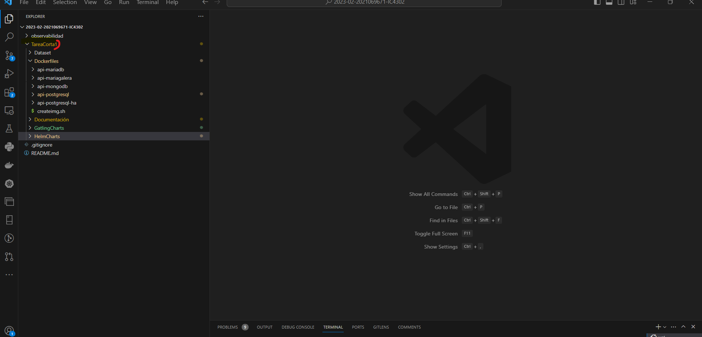
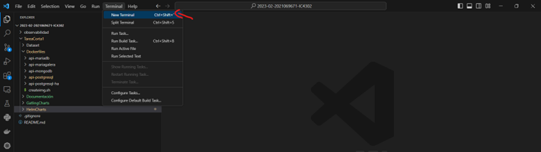
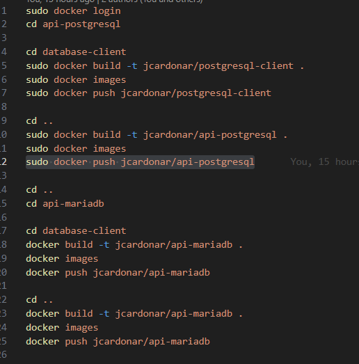
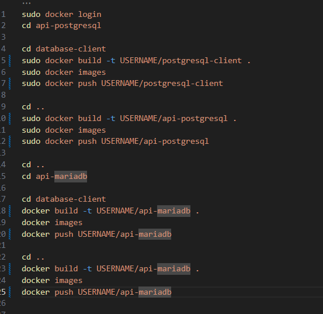
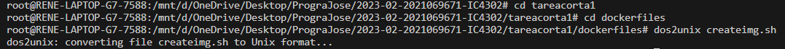
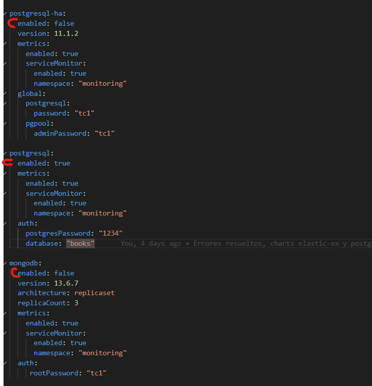
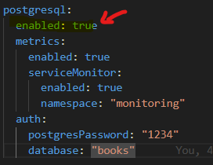

# Guía de Instalación

***Aclaracione importante: Para la guía re recomienda usar visual studio code, ya que imágenes y explicaciones serán basadas en el uso de la terminal WSL en esta aplicación.***

## Requisitos e Instalaciones Previas

Para la ejecución de esta tarea es necesario instalar los siguientes elementos:

- [Docker Desktop](https://www.docker.com/products/docker-desktop/)
- Kubernetes (se puede instalar desde la configuración de Docker Desktop)  
- [Helm Charts](https://helm.sh/docs/intro/install/)

En caso de tener Windows, se recomienda instalar WSL (Windows Subsystem for Linux) para poder ejecutar los archivos de automatización.

### Instalación de Docker

1. Descargar Docker Desktop desde el [sitio oficial](https://www.docker.com/products/docker-desktop/).
2. Instalar siguiendo las instrucciones del asistente de instalación. 
3. Una vez instalado, abrir la aplicación y verificar que Docker Engine se está ejecutando.

### Configuración de Kubernetes

1. En la configuración de Docker Desktop, dirigirse a la sección de Kubernetes.  
2. Activar la opción "Enable Kubernetes". Esto instalará un clúster de Kubernetes de un solo nodo.
3. Esperar a que el estado cambie a "Kubernetes is running".
4. Opcionalmente se puede cambiar el rango de direcciones IP del clúster. 

### Instalación de Helm

Para instalar Helm en la máquina local, seguir las instrucciones en la [documentación oficial](https://helm.sh/docs/intro/install/).

### Comprobación del Entorno 

Para verificar que todos los componentes están instalados y funcionando correctamente:

- Ejecutar `docker version` para verificar la instalación de Docker Engine
- Ejecutar `kubectl version` para verificar Kubernetes
- Ejecutar `helm version` para verificar Helm

Si todos los comandos anteriores muestran la versión, el entorno está listo para ejecutar la tarea.

## Instalación de Imágenes en Docker

Una vez que hayas instalado las herramientas necesarias y descargado el repositorio, abre la carpeta en la que se encuentra ubicado. Al hacer esto, verás algo similar a esto:

Ahora se abrira la terminal de visual Studio en WSL, esto se hace de la siguiente forma:

**`wsl`**

**`cd Tareacorta1`**

**`cd Dockerfiles`**

Estos comandos abrirán la terminal WSL y te llevarán a la carpeta que contiene el archivo para crear las imágenes de Docker necesarias para la ejecución correcta del programa. En este caso, cada imagen instalará el API de una base de datos distinta o la imagen del cliente de esa base de datos. El cliente se instala para poder manipular la base de datos y definir tablas e insertar datos correctamente.

El archivo Dockerfile se verá similar a esto:

Como se puede observar, cada una de las imágenes se crea por separado. Sin embargo, este código crea las imágenes en el repositorio de otra persona. Para instalar las imágenes en tus propios repositorios de Docker, debes cambiar todas las instancias del usuario por tus propias credenciales. Esto se verá así:

Debes reemplazar USERNAME por el nombre de tu usuario de Docker Desktop.

Una vez que hayas realizado este cambio, ejecuta los siguientes comandos en la terminal:

**`dos2unix createimg.sh`**

**`./createimg.sh`**

Estos comandos instalarán todas las imágenes de los APIs en repositorios separados para su uso posterior durante la ejecución del programa.

## Instalación de Helm Charts
Una vez se hayan instalado las imágenes para los API de las bases de datos es necesario escoger cuál base se desea hacer loadTest. Para esto es necesario ingresar a la carpeta HelmCharts/ Databases/ values.yaml desde la UI de visual code, una vez ahi se verán los siguientes parámetros

En este espacio podrán observarse todas las bases de datos disponibles para monitorear. Sin embargo, por cuestiones de espacio no se pueden ejecutar todas al mismo tiempo. Por lo tanto es necesario hacer lo siguiente:

La base de datos que se desea testear se le pone valor enabled: true

El resto es necesario asegurarse que tengan el valor enabled: false

# Conclusiones y Recomendaciones

### Pruebas locales antes de Docker

A la hora de implementar una imagen en Docker se recomienda probar primero el código que se quiera poner en el contenedor. En nuestro caso con las APIs nos fue increíblemente útil probarlas primero desde un IDE en Python y sin usar Docker. Esto nos salvo bastante tiempo durante el desarrollo y nos ayudo a prevenir confusiones en la detección de errores.

### Monitorización y generación de reportes 

Los reportes y visualizaciones que se pueden generar a través de métricas y timeseries, usando herramientas como Grafana y Prometheus son claves para tomar acciones y saber los límites de nuestra base de datos.

### Tipos de operaciones en pruebas de carga

A la hora de realizar las pruebas se deben tener en cuenta que distintos tipos de operaciones, incluso con la misma cantidad de usuarios puede llevar a resultados completamente distintos sobre la misma base de datos. Por ejemplo, una operación de GET no tendrá la misma carga que una operación PUT o POST.

### Postman para pruebas de API

Postman es una excelente herramienta para probar APIs. Cuenta con una completa colección de funciones para configurar cualquier tipo de petición HTTP: GET, POST, PUT, DELETE, etc. Aparte de esto la UI es sencilla de entender y utilizar.

### Limitaciones de dashboards pre-configurados

Si bien herramientas como Grafana proveen dashboards pre-configurados para visualizar métricas, estos no siempre incluirán todos los datos que se requiere monitorear. Muchas veces será necesario agregar paneles y métricas manualmente a los dashboards.

Por ejemplo, un dashboard general de una base SQL puede no tener información específica como el throughput de una API en particular. Hay que conocer los datos que se desean visualizar y agregarlos de forma explícita al dashboard.

Además, a medida que el sistema crece y hay nuevos datos, habrá que expandir los dashboards. Los dashboards pre-configurados son un buen punto de partida, pero esperar que muestren todas las métricas desde el inicio puede llevar a decepciones. Monitorear sistemas grandes requiere identificar las métricas clave y agregarlas de forma manual y progresiva.

### Ventajas de Docker y Kubernetes para pruebas de API

A la hora de probar APIs localmente, usar Docker y Kubernetes facilita el proceso ya que permiten ejecutar el API simultáneamente con otras aplicaciones si fuera necesario. Esto evita tener que detener otros servicios que usen los mismos puertos o recursos. Además, containerizar la API con Docker hace que su ejecución sea consistente en diferentes entornos. El código se ejecutará de la misma forma sin importar el sistema operativo o dependencias del host. 

# Resultados de las pruebas 

1- MariaDB

2- MariaDB Galera

3- PostGreSQL

4- PostGRE HA

5- ElasticSearch 

# Resultados en Grafana 

1- MariaDB

2- MariaDB Galera

3- PostGreSQL

4- PostGRE HA

5- ElasticSearch 

# Las conclusiones derivadas de los resultados de las pruebas de carga son las siguientes:

# Conclusiones

**Comunicación Efectiva y Colaboración en Equipos de Trabajo:** La comunicación fluida y la colaboración entre los miembros de un equipo son aspectos vitales para el éxito de cualquier proyecto. La capacidad de compartir ideas, resolver problemas y mantenerse actualizado sobre el progreso de las tareas son elementos cruciales para garantizar que todos estén en la misma página y trabajen de manera coordinada hacia objetivos comunes.

**Organización y Estructura:** Mantener un enfoque claro en las metas y objetivos, así como dividir las tareas de manera eficiente, garantiza que el equipo pueda avanzar de manera efectiva y evitar desviaciones innecesarias.

**Comprensión de Conceptos Fundamentales:** Sin una comprensión sólida de los conceptos clave relacionados con el proyecto, es difícil llevar a cabo las tareas de manera efectiva. La adquisición y aplicación de conocimientos son fundamentales para tomar decisiones informadas y evitar errores costosos.

**Herramientas de Desarrollo y Control de Versiones:** El dominio de herramientas como GitHub y Docker simplifica enormemente la colaboración en equipo y la gestión de proyectos. Facilitan el seguimiento de cambios, la integración de código y aseguran una ejecución consistente de aplicaciones en diferentes entornos, lo que aumenta la eficiencia y la portabilidad del software.

**Preservación de la Estructura del Proyecto:** Mantener la estructura del proyecto a lo largo del tiempo es esencial para la mantenibilidad y la escalabilidad. Evita el caos y la confusión a medida que el proyecto crece y se desarrolla, lo que ahorra tiempo y recursos en el futuro.

**Legibilidad y Comprensibilidad del Código:** La legibilidad y la comprensibilidad del código son imperativos para facilitar la colaboración y el mantenimiento continuo. Un código que se puede entender rápidamente permite a los desarrolladores trabajar de manera más eficiente y tomar decisiones informadas.

**Herramientas de Visualización y Monitoreo:** Herramientas como Grafana ofrecen una visión en tiempo real de sistemas y aplicaciones, lo que ayuda a detectar problemas y a tomar medidas correctivas de manera proactiva. Esto es esencial para garantizar un rendimiento óptimo y una experiencia de usuario sin problemas.

**Pruebas de Rendimiento con Gatling:** Utilizar herramientas como Gatling para realizar pruebas de carga es una práctica crucial para garantizar que una aplicación o sistema pueda manejar cargas de trabajo realistas y mantener su rendimiento. Identificar cuellos de botella antes del lanzamiento es fundamental para evitar problemas.

# Recomendaciones

**Mantener la Organización:** Siguiendo el ejemplo del profesor o utilizando una metodología de gestión de proyectos, asegurándose de mantener una estructura organizativa sólida para la tarea. Esto incluye la definición de objetivos claros y la asignación de responsabilidades.

**Reuniones de Seguimiento Regular:** Es fundamental programar reuniones periódicas para evaluar el progreso de la tarea. Dichas reuniones permiten mantener a todos los miembros del equipo actualizados y proporcionan un espacio para discutir posibles problemas y soluciones.

**Revisar y Ampliar Conocimientos:** No limitarse a lo que se enseña en clase. Es primordial repasar los conceptos aprendidos, investigar y profundizar en el tema. La investigación adicional puede proporcionar ideas frescas y enfoques innovadores.

**Dominar GitHub y Control de Versiones:** Aprender a utilizar herramientas como GitHub es esencial para el desarrollo colaborativo. Familiarízate con las funcionalidades básicas de control de versiones y colaboración en repositorios.

**Adherirse a Estándares de Codificación:** Establecer y seguir un estándar de codificación dentro del equipo. Esto mejora la consistencia y la legibilidad del código, lo que facilita la colaboración y el mantenimiento.

**Aprendizaje Continuo:** Desarrollar la mentalidad de aprendizaje continuo es valioso no solo para la tarea actual, sino para el crecimiento a largo plazo como profesional. Siempre buscar oportunidades para adquirir nuevas habilidades y conocimientos.

**Investigación de Herramientas Esenciales:** Antes de elegir herramientas para cualquier proyecto, investigar a fondo y tomar notas sobre sus características clave y cómo se integran en la solución. Esto ayudará a tomar decisiones informadas.

**Estructura y Descomposición del Proyecto:** Diseñar una estructura de proyecto coherente el trabajo en tareas más pequeñas y manejables. Esto facilita la gestión y la colaboración eficiente.

**Asignación de Tareas:** Dividir el trabajo y asignar tareas específicas a cada miembro del equipo. Esto evita duplicaciones, mejora la eficiencia y permite un seguimiento más preciso del progreso.

**Definir Roles y Responsabilidades:** Establecer roles dentro del equipo es crucial para mantener la organización. Define quién es responsable de qué y asegurarse de que todos comprendan sus roles y responsabilidades.

